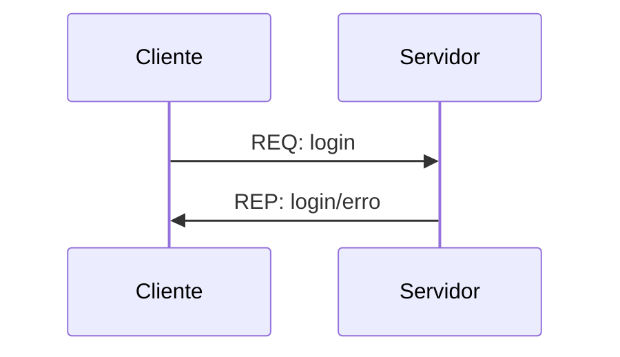
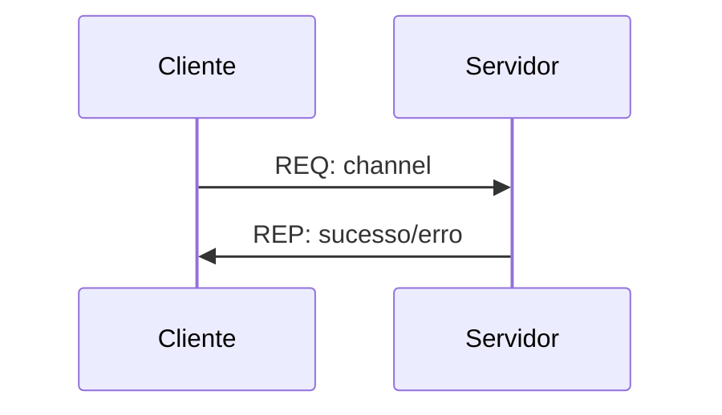
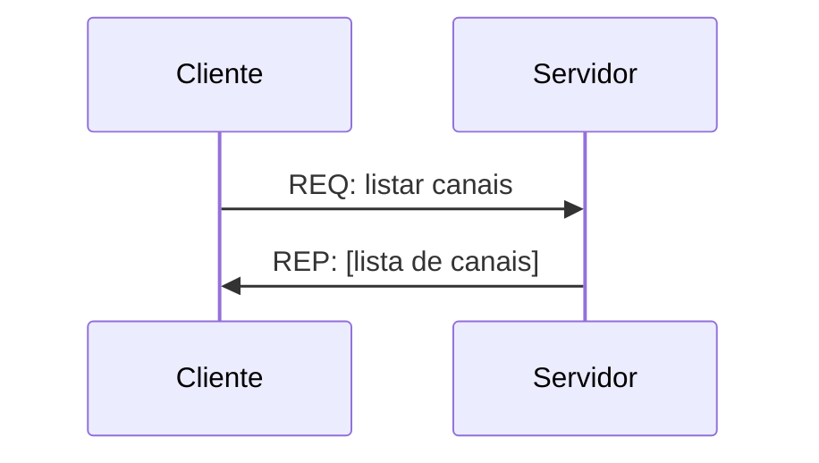

# Parte 1: Login de usuário e criação de canais

A primeira parte que iremos implementar é o começo da interação do bot (cliente) com o servidor. Para isso, o bot deve conseguir fazer login no serviço, listar os canais disponíveis e criar novos canais (a publicação das mensagens será realizada na próxima parte do projeto).

## Definições sobre troca de mensagens

Como esta é a primeira parte do projeto, ela contém definições do que será usado nas partes seguintes do projeto, ou seja, algumas escolhas feitas agora deverão ser seguidas nas próximas partes.

O formato da mensagem que será trocada deve ser definido pelo grupo (considerando que esta mensagem deverá funcionar com todos os servidores e clientes que serão desenvolvidos), porém existem 2 itens que são obrigatórios:
1. Todas as mensagens devem conter o timestamp do envio
2. As mensagens devem ser serializadas em binário usando algum formato conhecido (e.g., ProtoBuff, Apache Avro, Thrift, MessagePack, etc). Não podem ser envidas mensagens usando JSON, XML ou texto simples.

Para as próximas partes, as mensagens deverão manter o formato de serialização escolhido e devem conter o timestamp do envio.

## Login do usuário

O primeiro passo é realizar o login do bot assim que o serviço estiver disponível. Como este projeto é um protótipo, não vamos ter senhas, somente o nome do usuário. Neste caso, a troca de mensagem entre o usuário e o servidor será:

Ou seja, o bot envia uma mensagem pedindo para fazer o login e o servidor responde avisando se o login foi bem sucedido ou se ocorreu algum erro. Para o login, apenas uma mensagem deve ser enviada do cliente para o servidor e o servidor deve responder somente esta mensagem. Em caso de erro, o processo de login do usuário deve ser repetido.

Assim como o formato da mensagem, os erros que serão considerados e a forma como serão tratados deve ser definida pelo grupo.

## Criação e listagem de canais 

Da mesma forma que fizemos com os usuários, vamos implementar uma forma do usuário descobrir quais canais para troca de mensagens estão disponíveis e também de criar um canal novo caso este não exista.

Para criação de um canal vamos usar o padrão de troca de mensagem como:

Em que o cliente deve enviar o nome do canal para o servidor e o servidor deve responder se o canal foi criado com sucesso.

O tratamento para a criação de canais duplicados, nomes permitidos e critério para o cliente definir se criará um canal ou não deve ser definido pelo grupo.

Para o da listagem de canais, o padrão fica:

Neste caso, o cliente apenas pede a lista de canais para o servidor e recebe uma lista somente com os nomes de todos os canais que já existem. O formato da lista deve ser definido pelo grupo. 

## Persistência dos dados

Para não perder informações entre as sessões, o servidor deve armazenar os dados em disco e, como informado no enunciado do projeto, a forma como o dado será armazenado é livre. Porém, os dados que devem ser armazenados serão padronizados, ou seja:
- cada servidor deve manter o seu conjunto de dados (este arquivo não deve ser compartilhado entre os servidores)
- o servidor deve armazenar todos os logins realizados pelos usuários junto com o timestamp do login
- todos os canais criados pelos usuários devem ser armazenados para serem usados por todos os outros usuários
- nas próximas partes do projeto vamos adicionar a persistência das mensagens postadas e enviadas

## Entrega
Como esta é a primeira parte do projeto, todos os arquivos que serão entregues serão novos e (provavelmente) nas próximas partes serão entregues os mesmos arquivos com as adições e alterações feitas.
Tanto o arquivo zip como a branch deverão conter:
- `README.md` contendo uma introdução do projeto e uma explicação sobre as escolhas feitas (i.e., linguagens, serialização e persistência)
- `Dockerfile` (ou `Containerfile`) para a criação das imagens que serão necessárias para executar o projeto
- `docker-compose.yaml` para execução de todos os containers do projeto considerando a execução de 2 clientes e 2 servidores para cada integrante do grupo
- código fonte do(s) cliente(s), servidore(s) e broker implementados nas linguagens escolhidas

A correção do projeto será feita a partir da execução do comando `docker compose up` que deverá subir todos os containers e realizar as trocas de mensagens.
