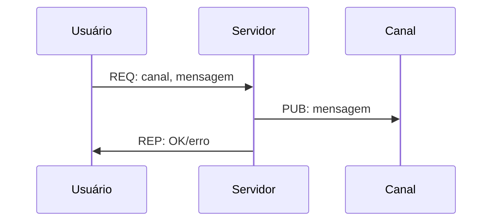

# Parte 2: Publicação em canais usando Publisher-Subscriber

Uma vez que os bots conseguem pedir informações ao servidor, é possível permitir que eles publiquem em canais. Para isso, o usuário fará uma requisição ao servidor e o servidor publicará o texto no canal correto usando o nome do canal como tópico da mensagem.

## Funcionalidades que devem ser implementadas, mas que não precisam de troca de mensagens

Para facilitar um pouco o desenvolvimento do projeto, o proxy para o Pub/Sub será separado do broker do Req-Rep. Adicione este novo container ao `docker-compose.yml` usando a porta 5557 como `XSUB` e 5558 como `XPUB`.

Para que as publicações funcionem, é necessário que os usuários possam se inscrever nos tópicos do Pub/Sub, ou seja, ter a opção de se inscrever em canais que foram criados no servidor. Esta escolha dos canais será realizada apenas no cliente pois este deve conseguir se inscrever em diversos tópicos para a mesma conexão com o proxy.

A partir desta parte do projeto, o servidor também deve persistir em disco as publicações e mensagens trocadas pelos usuários. O formato do armazenamento é livre, porém deve ser armazenado de forma que seja possível recuperar todas as informações caso seja necessário no futuro.

## Incrição em canais

Considerando que os canais para a publicação são os tópicos das mensagens do Pub/Sub, o bot deve conseguir se inscrever de forma aleatória em tópicos. A partir do instante que a inscrição é realizada, todas as mensagens recebidas pelo bot em qualquer um dos tópicos/canais deve ser exibida na tela e deve conter o canal em que foi enviada a mensagem, a mensagem e o timestamp do envio da mensagem e do recebimento da mensage.m

## Publicações em canais

Para a publicação em um canal, o usuário fará uma requisição ao servidor e este fará a publicação no canal (tópico)  escolhido e em seguida retornará ao usuário o status da publicação. O diagrama a seguir mostra a troca de mensagens entre o usuário (i.e., cliente) e o servidor.

Desta forma, o usuário enviará a mensagem ao servidor e saberá se teve algum problema com a publicação da mensagem.

Da mesma forma que na parte 1, todas as mensagens trocadas tanto para a solicitação da publicação como para a publicação da mensagem devem conter o timestamp do envio.

## Funcionamento dos bots para facilitar os testes

Para ajudar nos testes que serão feitos nas próximas partes, o funcionamento dos bots será padronizado. Ao conectar no servidor, o bot deverá:
1. se existirem menos do que 5 canais, o bot deverá criar um novo
1. se o bot estiver inscrito em menos do que 3 canais, ele deverá se inscrever em mais um
1. ficar em loop infito fazendo:
  1. escolher um canal da lista de canais diposníveis
  1. enviar 10 mensagens aleatórias com intervalo de 1 segundo entre as mensagens

## Entrega
Além dos arquivos entregues na primeira parte, esta deverá conter:
- código fonte do proxy implementado
- `docker-compose.yaml` atualizado com o proxy
- `README.md` atualizado com as explicações das escolhas feitas para a troca de mensagens e armazenamento das publicações dos bots
