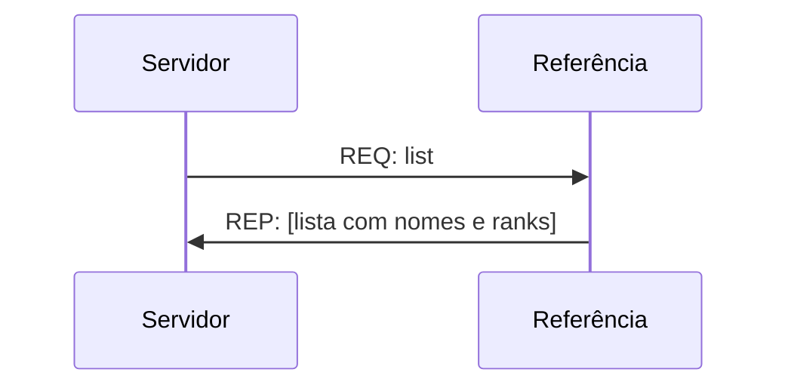
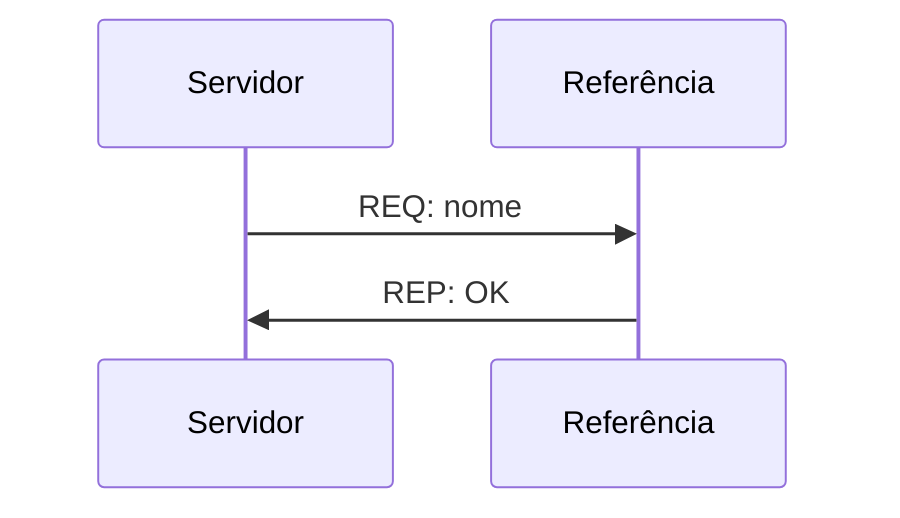

# Parte 3: Relógios e heartbeat

Uma vez que servidores e bots estão funcionando, podemos adicionar os relógios para sincronizar todos os processos. Nesta parte do projeto vamos adicionar o relógio lógico em todas as mensagens e a sincronização do relógio físico nos servidores usando um processo como coordenador.

## Relógio lógico

O relógio lógico deverá ser implementado tanto no cliente/bot como no servidor. Para isto será usado um contador que iniciará junto com o processo e deve seguir a proposta, conforme apresentada em aula:
1. o contador deve ser incrementado antes do envio de cada mensagem e deve ser enviado junto com a mensagem
2. quando uma mensagem for recebida, o processo deve comparar o seu contador com o que foi recebido na mensagem e usar como novo valor de seu contador o máximo entre o valor recebido na mensagem e o valor que possuia

Portanto, todas as mensagens que foram trocadas devem possuir além do timestamp, o valor do contador de quem envia a mensagem.

## Sincronização do relógio dos servidores

Para a sincronização dos servidores, vamos criar um novo processo (que deve ser adicionado ao `docker-compose.yml`) que servirá como referência para informações como endereços dos servidores e rank do servidor.

Este novo processo fará apenas a comunicação com os servidores e não receberá mensagens dos clientes. Ele será responsável por:
1. informar o rank do servidor: o servidor deve fazer uma requisição para saber o seu rank e receberá este valor no reply, conforme o padrão a seguir:

2. armazenar a lista de servidores cadastrados: quando um servidor inicia e faz o pedido de rank, ele deve armazenar o nome e rank do servidor, sem repetições de nome;

3. fornecer a lista de servidores: deve possuir um serviço que retorna o nome e rank de todos os servidores que estão disponíveis, conforme o padrão a seguir:

4. atualizar a lista de servidores conforme a disponibilidade (heartbeat): cada servidor deve enviar periodicamente (a cada 10 mesnagens de clientes recebidas) uma mensagem a este processo avisando que ainda está funcionando para ser mantido na lista de servidores. Caso o servidor não envie esta mensagem de heartbeat, o serviço deve remover o servidor da lista de servidores disponíveis.

5. atualizar o relógio do servidor: aproveitando a mensagem de heartbeat, o servidor tabém deverá pedir a hora correta para o serviço de referência.

## Entrega
Esta parte do projeto adiciona um novo serviço de referência para sincronização dos relógios e manutenção da lista de servidores disponíveis. Portanto, para esta parte do projeto deverão ser entregues:
- `docker-compose.yml` atualizado com o novo serviço;
- código fonte do serviço de referência;
- código dos servidores com as alterações para adicionar o relógio lógico e atualização do relógio físico;
- código dos bots com as alterações para o relógio lógico;
- código do broker e proxy sem atualização;
