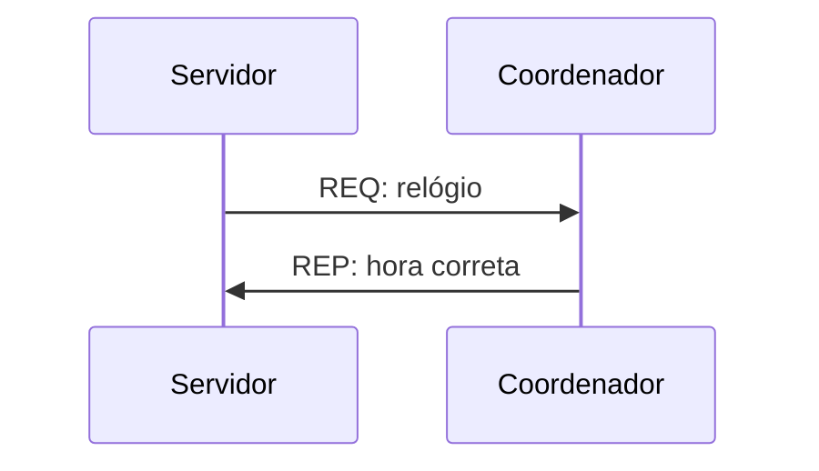
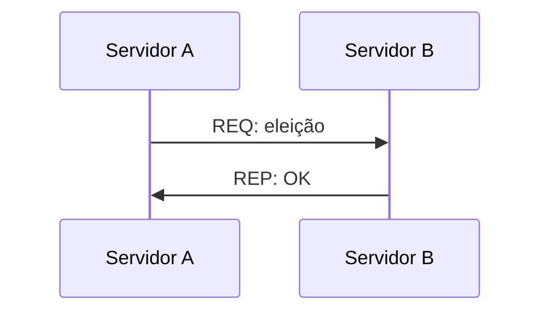
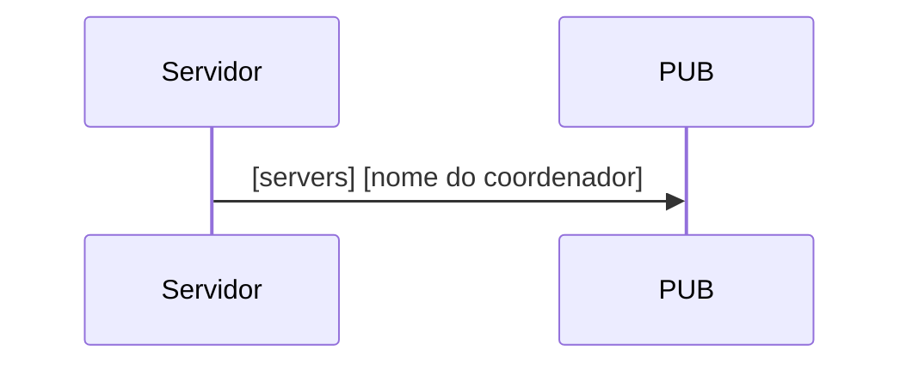

# Parte 4: Eleição

Na parte anterior foi adicionado um serviço de referência para dar rankings e sincronizar o relógio dos servidores. Nesta parte, a atualização do relógio será modificada para que um dos servidores seja escolhido como coordenador e deverá fornecer a hora correta para os outros servidores.

Para a sincronização do relógio vamos usar o algoritmo de Berkeley e os servidores devem manter uma variável com o nome do servidor que foi eleito como coordenador, além de atualizarem os seus relógios a cada 15 mensagens trocadas. Os servidores devem conseguir realizar a troca de mensagem para a sincronização do relógio segundo:

E caso o coordenador não esteja disponível, um servidor deve ser capaz de enviar uma requisição aos outros servidores pedindo eleição:

e também devem conseguir avisar a todos os outros servidores por meio de uma publicação no tópico `servers` que quando é eleito como servidor:

Com estas mudanças podemos testar se os servidores estão sincronizando o relógio com o coordenador e também se os relógios lógicos estão atualizados. Estas função serão úteis na próxima (e última) parte do projeto.

## Entrega
Nesta parte apenas os servidores tiveram modificações e o serviço de referência não deve mais retornar a hora como resposta do heartbeat, portanto é necessário entregar:
- o código dos servidores atualizados com a eleição e atualização do relógio
- o código do serviço de referência atualizado para não responder o heartbeat com a hora
- os outros arquivos sem nenhuma atualização
